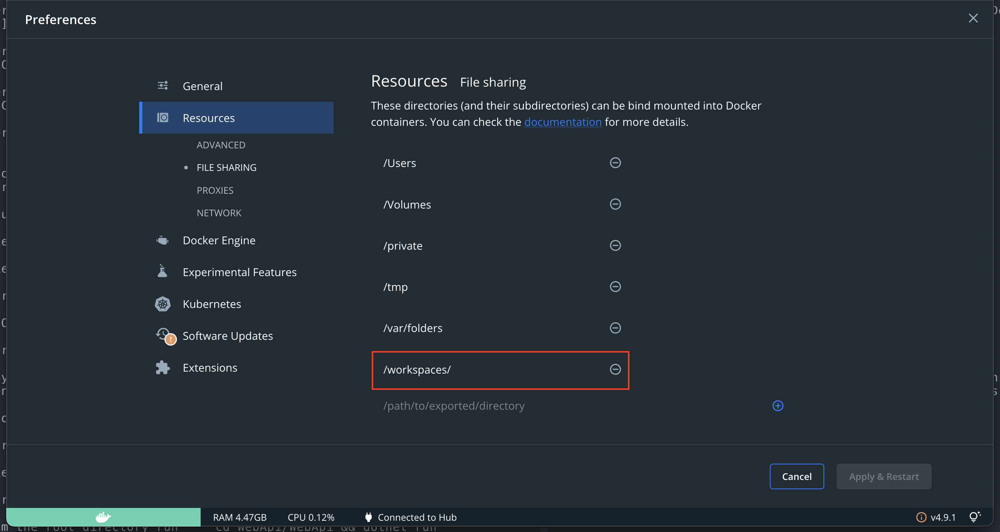

# Instructions Compile
Here you will find basic instructions for getting up and running.

## Prerequisite Installs

- [Docker Desktop](https://www.docker.com/products/docker-desktop/)

    Terminal command ([using winget](https://learn.microsoft.com/en-us/windows/package-manager/winget/)): `winget install --id=Docker.DockerDesktop --exact`
- [Git](https://git-scm.com/downloads)

    Terminal command: `winget install --id=Git.Git --exact`
- [VS Code](https://code.visualstudio.com/)

    Terminal command: `winget install --id=Microsoft.VisualStudioCode --exact`
- [VS Code Dev Containers Extension](https://marketplace.visualstudio.com/items?itemName=ms-vscode-remote.remote-containers)

    Terminal command: `code --install-extension ms-vscode-remote.remote-containers --force`


**Figure: The Dev Container extension**

## Setup Steps

1. Make sure docker is running


**Figure: Check that Docker is successfully running and the bottom left is green**

2. MacOS only - Within Docker, navigate to **Preferences | Resources | File Sharing** and add `/workspaces` as a resource


**Figure: /workspaces is added as a resource**

3. Authenticate with GitHub via the [CLI](https://docs.github.com/en/get-started/getting-started-with-git/caching-your-github-credentials-in-git#github-cli)
4. Copy the [GitHub Https clone url](https://docs.github.com/en/repositories/creating-and-managing-repositories/cloning-a-repository) from this repo
5. Open VS Code [command palette](https://code.visualstudio.com/docs/getstarted/userinterface#_command-palette) and select [Dev Containers: Clone Repository in Named Container Volume](https://code.visualstudio.com/docs/devcontainers/containers#_quick-start-open-a-git-repository-or-github-pr-in-an-isolated-container-volume) then paste the url from above and press enter to open the container.


**Figure: Dev Container opened in VS Code**


**Figure: Dev container successfully running**

6. From the root directory run ``` cd WebApi/WebApi && dotnet run ```
7. Navigate to https://localhost:7024/swagger/index.html and you will notice a certificate error similar to the below:


**Figure: The certificate error in the API**

8. Select Advanced | Proceed to localhost (unsafe)
Note: Ordinarily, you would want to make sure that the certificate is trusted, but we are ignoring it because it is a [known issue with dev containers](https://github.com/microsoft/vscode-remote-release/issues/6092)
9. Now, verify you can see Swagger with the WeatherForecast endpoint
10. Try calling the WeatherForecast endpoint and check that you can see some data
11. Open a new terminal in /WebUi and run npm i
12. Run npm start following the prompts to get going
13. Navigate to http://localhost:4200 and verify you can see the weather forecasts loading


**Figure: The app finally running!**

## Troubleshooting Tips
- Try restarting VS Code
- Try restarting your laptop
- Check that you have opened the folder that contains the .devcontainer folder
