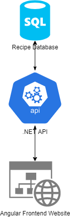

This documents aims to provide an overview of the technologies used in this project and the architecture that will be used throughout its lifetime.

# Architecture Diagram(s)

  
**_Figure: SSW.FireBootCamp Recipe App Architecture Diagram_**

# Languages and Frameworks
* Frontend - Angular
* Backend API - .NET + EF Core
* Database - SQL Server
* Dev Tools - Dev Containers + GitHub + VS Code

# 3rd Party Libraries
No notable 3rd party libraries